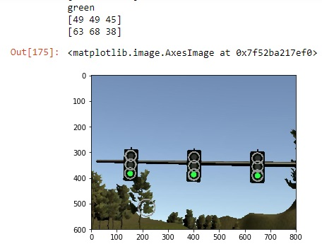
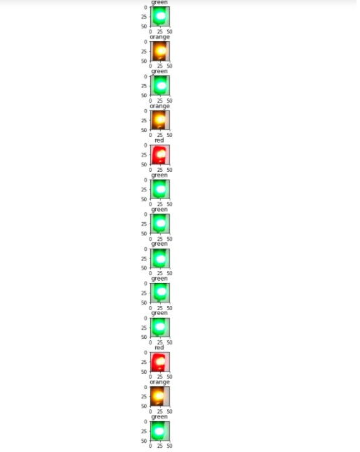

This is the project repo for the final project of the Udacity Self-Driving Car Nanodegree: Programming a Real Self-Driving Car. For more information about the project, see the project introduction [here](https://classroom.udacity.com/nanodegrees/nd013/parts/6047fe34-d93c-4f50-8336-b70ef10cb4b2/modules/e1a23b06-329a-4684-a717-ad476f0d8dff/lessons/462c933d-9f24-42d3-8bdc-a08a5fc866e4/concepts/5ab4b122-83e6-436d-850f-9f4d26627fd9).

### Purpose

The main goal of the project is to implement some basic functionality of an autonomous vehicle system by writing ROS nodes.
The system architectrue of the used system is shown on the below image:


The project aimed to code the following ROS nodes:
* Traffic Ligth Detection Node
* Waypint Updater Node
* DBW Node

### Team

The project has been completed by the following team.
* Krisztián Sarnyai (krisztian.sarnyai@nng.com)
* Attila Sándor (attila.sandor@nng.com)
* Barnabás Tiegelmann (barnabas.tiegelmann@nng.com)
* Sándor Füleki (sandor.fuleki@nng.com)

### Native Installation

* Be sure that your workstation is running Ubuntu 16.04 Xenial Xerus or Ubuntu 14.04 Trusty Tahir. [Ubuntu downloads can be found here](https://www.ubuntu.com/download/desktop).
* If using a Virtual Machine to install Ubuntu, use the following configuration as minimum:
  * 2 CPU
  * 2 GB system memory
  * 25 GB of free hard drive space

  The Udacity provided virtual machine has ROS and Dataspeed DBW already installed, so you can skip the next two steps if you are using this.

* Follow these instructions to install ROS
  * [ROS Kinetic](http://wiki.ros.org/kinetic/Installation/Ubuntu) if you have Ubuntu 16.04.
  * [ROS Indigo](http://wiki.ros.org/indigo/Installation/Ubuntu) if you have Ubuntu 14.04.
* Download the [Udacity Simulator](https://github.com/udacity/CarND-Capstone/releases).

### Docker Installation
[Install Docker](https://docs.docker.com/engine/installation/)

Build the docker container
```bash
docker build . -t capstone
```

Run the docker file
```bash
docker run -p 4567:4567 -v $PWD:/capstone -v /tmp/log:/root/.ros/ --rm -it capstone
```

### Port Forwarding
To set up port forwarding, please refer to the "uWebSocketIO Starter Guide" found in the classroom (see Extended Kalman Filter Project lesson).

### Usage

1. Clone the project repository
```bash
git clone https://github.com/udacity/CarND-Capstone.git
```

2. Install python dependencies
```bash
cd CarND-Capstone
pip install -r requirements.txt
```
3. Make and run styx
```bash
cd ros
catkin_make
source devel/setup.sh
roslaunch launch/styx.launch
```
4. Run the simulator

### Real world testing
1. Download [training bag](https://s3-us-west-1.amazonaws.com/udacity-selfdrivingcar/traffic_light_bag_file.zip) that was recorded on the Udacity self-driving car.
2. Unzip the file
```bash
unzip traffic_light_bag_file.zip
```
3. Play the bag file
```bash
rosbag play -l traffic_light_bag_file/traffic_light_training.bag
```
4. Launch your project in site mode
```bash
cd CarND-Capstone/ros
roslaunch launch/site.launch
```
5. Confirm that traffic light detection works on real life images

### Implementation of the Waypint Updater Node

First we implemented the Waypint Updater node. This node publishes waypoints from the car's actual position to some distance ahead.
For this the node needs to know the position of the car and the list of all the waypoints.
To get this information this node subscribes to the /current_pose and the /base_waypoints topics.
To consider the traffic lights, subscription to the /traffic_waypoint topic is also necessary.

```
	rospy.Subscriber('/current_pose', PoseStamped, self.pose_cb)
	rospy.Subscriber('/base_waypoints', Lane, self.waypoints_cb)
	rospy.Subscriber('/traffic_waypoint', Int32, self.traffic_cb)
    
	self.final_waypoints_pub = rospy.Publisher('final_waypoints', Lane, queue_size=1)
```

The waypoints_cb() callback is called when the /base_waypoints topic provides the waypoint list in a message. The received waypoints are stored in a KDTree.
The pose_cb() callback is updating the actual car position based on the received message.
Through the /traffic_waypoint topic the node receives an index which points to the waypoint of the stopline the car needs to stop at.

To publish the limited number of waypoints ahead of the car, in the node loop the publish_waypoints() function is called. This functions prepares the waypoint list to send. In case there's a red light ahead, the decelerate_waypoints() function updates the velocities of the waypoints using a square root shaped function.


### Implementation of the DBW Node

The DBW (drive by wire) node governs the physical operation of the vehicle by sending throttle, brake, and steering commands.
The input of the node is the /twist_cmd topic, also the /vehicle/dbw_enabled topic is listened to check when we have control of the car.

```
	rospy.Subscriber('/vehicle/dbw_enabled', Bool, self.dbw_enabled_cb)
	rospy.Subscriber('/twist_cmd', TwistStamped, self.twist_cb)
	rospy.Subscriber('/current_velocity', TwistStamped, self.velocity_cb)
	
	self.steer_pub = rospy.Publisher('/vehicle/steering_cmd', SteeringCmd, queue_size=1)
	self.throttle_pub = rospy.Publisher('/vehicle/throttle_cmd', ThrottleCmd, queue_size=1)
	self.brake_pub = rospy.Publisher('/vehicle/brake_cmd', BrakeCmd, queue_size=1)	
```

Through the /twist_cmd topic a linear and angular velocity values arrive. Based on these values the control() method of the Controller class is calculating the necessary throttle, brake and steering control values and they are being published through the /vehicle/steering_cmd, /vehicle/throttle_cmd and /vehicle/brake_cmd topics towards the Simulator or the car itself.


### Implementation of the Traffic Ligth Detection Node

The purpose of the Traffic Ligth Detection node is to warn the car if there's a red traffic light ahead so the car can stop. The position of all the traffic lights are known via the /vehicle/traffic_lights topic.
Considering the current position of the car (/current_pose) the node should send the index of the waypoint for the nearest upcoming red light's stop line (/traffic_waypoint). 

```
	sub1 = rospy.Subscriber('/current_pose', PoseStamped, self.pose_cb)
	sub2 = rospy.Subscriber('/base_waypoints', Lane, self.waypoints_cb)
	sub3 = rospy.Subscriber('/vehicle/traffic_lights', TrafficLightArray, self.traffic_cb)

	self.upcoming_red_light_pub = rospy.Publisher('/traffic_waypoint', Int32, queue_size=1)
```	
The Traffic Ligth Detection node use LightDetector class. This class was implemented in python and uses many techniques that we learned about image manipulation and shape detection.
To study the proper behavior of the class, we created an ipynb project file that you can find here: "Traffic Docs/Traffic_Light_Classifier.ipynb"

The project uses image blurring (image Smoothing) to make circle detection easier.
[Read more about Blurring here](https://opencv-python-tutroals.readthedocs.io/en/latest/py_tutorials/py_imgproc/py_filtering/py_filtering.html)

Original image:


Blurred green light image:


After blurring the circle detection in Hough image space is more effective.
[Read more about HoughCircles here](https://docs.opencv.org/master/da/d53/tutorial_py_houghcircles.html)



The next step after we found the circles on the image to select the green,red,and yellow colored ones.
HoughCircles function provided by opencv is giving back also the coordinates of the circle middle position so we can get the pixel or pixels around it. The pixel colour identification is tuned by hand.
There are three functions in LightDetector class to decide the color is red,green or yellow, the parameter of them is a pixel from the image.
drawCirclesAndGetImages function has made for cropping out the detected circle of the image and collect them into one list with the classified color.
This function has been simplified in the node because image generation is not required for classification.
After all the getLightColor decides what color we return from that image. If we seen a red, we returning red always. If we seen a green we keep looking if there is a red or an orange on the picture because we always care about reds. If we seen an orange we keep looking as same as in the green case.



More information and example codes can be found at "Traffic Docs/Traffic_Light_Classifier.ipynb" project.
